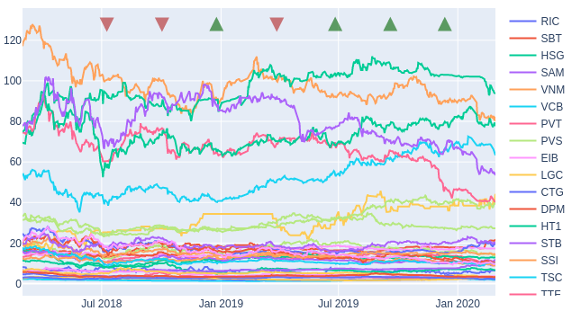
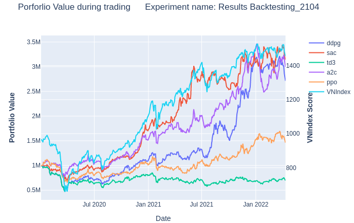

<h1 align="center">MMLab Trading: An Algorithmic Trading Framework</h1>

<p align="center">
<b>MMLab Trading is still in Beta, meaning it should be used very cautiously if used in production, as it may contain bugs.</b>
</p>

<p align="center">
  
</p>

<p>
  
  <a href="https://twitter.com/manhkhanhad" target="_blank">
    
  </a>
</p>


MMLab Trading is an open source Python framework apply reinforcement learning for automatic stock trading and Linear Programming for portflio optimization. 

# 🔧 Install 

# ✨ Getting Started
## Portfolio Optimization
1. Download stock historical prices and Market Index (i.e VNIndex) into `Data` folder
2. Setting the hyperparameter in `PortfolioOptimization/config_LP.yaml`
### Evaluate portfolio optimization
 ```
 python LinearOptimization.py
 ```
 
 <p align="center">
  
</p>

### Running

4. Train the Senario Classifier for determining whether the current is good time to start inverst
```
python SenarioClassification.py
```
5. Optimize the stock portfolio
```
python app.py
```
## Stock trading
0. Setting the hyperparameter in `config.yaml`
1. Download stock historical prices and Market Index (i.e VNIndex) into `Data` folder
2. Preprocess data
```
python data_processer.py
```
3. Training
```
python train.py
```
4. Testing 
```
python test.py
```
The strcuture of result folder will be organize as follow
```
Result folder  
│
└───1st Period
│   ├── result.png # Portpolio value of all agent during trading period
│   ├── result.html
│   └─── Agent 1 
│       ├── sell_buy.csv  #Trading action of agent
│       ├── account_value.csv #Portpolio value during trading
│       └─── trading action
│   		├── html
|			|	├── stock_1.html #Visualize trading action of each stock
|			|   ...
|    		└── png
|				├── stock_1.png
|				....
...
```
### Backtesting
Backtesting is an evaluation technique that simulates the use of an agent in a live trading environment. First, we train all agents for a certain period, and then we divide the remaining time into short periods with specified window size.   We have all agents trade on a small-time period and save their actions and portfolio values. We then update the training set with the previous trading period and retrain all agents. This process is repeated until there are no trading periods left.

 <p align="center">
  
</p>

# 👤 Author

**Manh-Khanh Ngo Huu** [manhkhanhad](https://github.com/manhkhanhad)


# 🔰 References

#  Acknowledgement

Give a ⭐️ if this project helped you!
